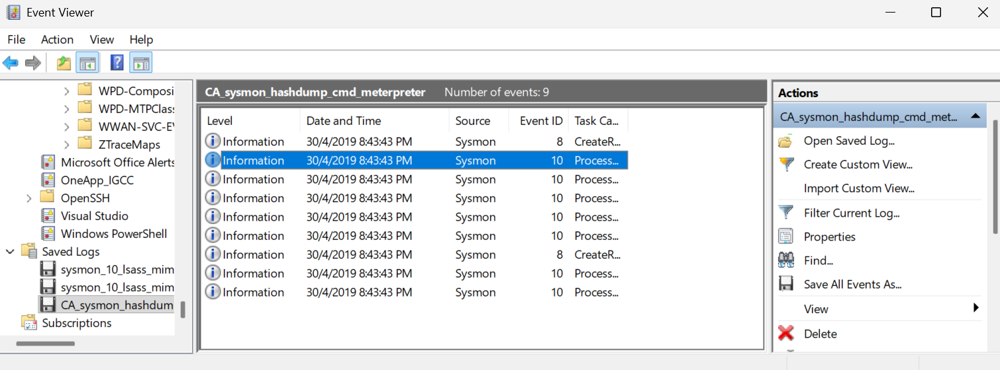
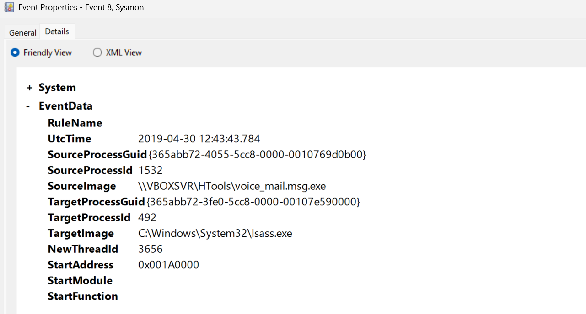
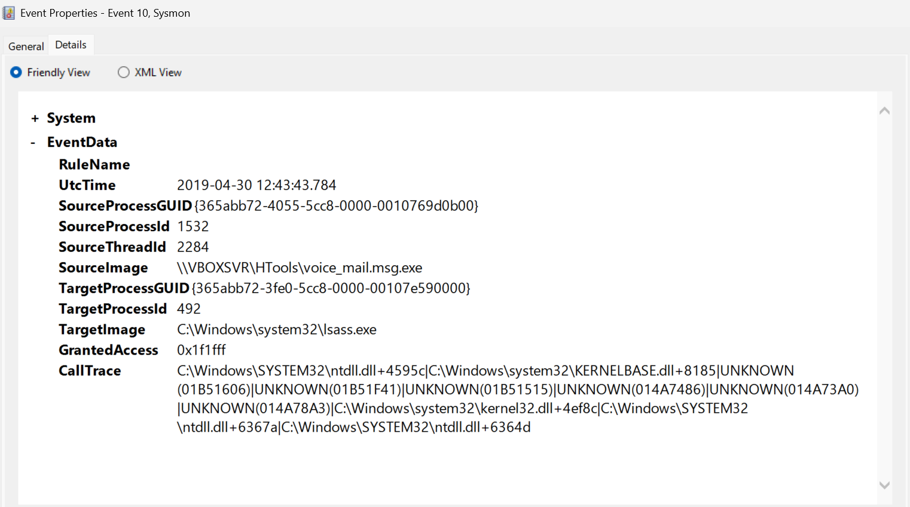

# Incident Response Report
## IR-2026-002 — Meterpreter LSASS Credential Dumping via Process Injection

| Field | Details |
|---|---|
| **Report ID** | IR-2026-002 |
| **Date Analyzed** | June 2026 |
| **Log Date** | 2019-04-30 |
| **Analyst** | yduduu |
| **Severity** | Critical |
| **Status** | Closed — Confirmed Malicious |
| **Host** | IEWIN7 |
| **Attacker Context** | SYSTEM (S-1-5-18) |

---

## 1. Executive Summary

On 2019-04-30 at 12:43 UTC, Sysmon captured a multi-stage credential theft attack on host IEWIN7. A suspicious executable disguised as a voicemail attachment (voice_mail.msg.exe) was launched from a remote network share and injected shellcode threads directly into lsass.exe using CreateRemoteThread (Event ID 8). The injected shellcode then accessed lsass memory with full permissions (GrantedAccess: 0x1f1fff) across 7 separate access events (Event ID 10), consistent with a Meterpreter hashdump module extracting all cached credential hashes.

The attack was fully fileless — all malicious code ran from unmapped memory with no DLL or module signature, making it invisible to traditional antivirus scanning.

> Note: This investigation uses a historical attack dataset (2019) for training purposes. The techniques demonstrated — LSASS memory dumping and process injection — remain actively used by threat actors in 2026.

Two MITRE ATT&CK techniques were confirmed:
- T1055 — Process Injection (CreateRemoteThread into lsass)
- T1003.001 — OS Credential Dumping: LSASS Memory

---

## 2. Detection Details

| Field | Value |
|---|---|
| **Detection Source** | Sysmon Event ID 8 + Event ID 10 |
| **Primary Technique** | T1055 — Process Injection |
| **Secondary Technique** | T1003.001 — LSASS Memory Dump |
| **Tactic** | Credential Access (TA0006) |
| **Severity** | Critical |
| **Host** | IEWIN7 |
| **Timestamp** | 2019-04-30 12:43:43 UTC |
| **Total Events** | 9 (2× Event ID 8, 7× Event ID 10) |

---

## 3. Attack Timeline

| Time (UTC) | Event ID | Description |
|---|---|---|
| 12:43:43.784 | 8 | voice_mail.msg.exe injected Thread 1744 into lsass.exe via CreateRemoteThread |
| 12:43:43.784 | 8 | voice_mail.msg.exe injected Thread 3656 into lsass.exe — second injection |
| 12:43:43.784 | 10 | lsass.exe accessed with GrantedAccess 0x1f1fff — credential extraction #1 |
| 12:43:43.784 | 10 | lsass.exe accessed — credential extraction #2 |
| 12:43:43.784 | 10 | lsass.exe accessed — credential extraction #3 |
| 12:43:43.784 | 10 | lsass.exe accessed — credential extraction #4 |
| 12:43:43.784 | 10 | lsass.exe accessed — credential extraction #5 |
| 12:43:43.784 | 10 | lsass.exe accessed — credential extraction #6 |
| 12:43:43.784 | 10 | lsass.exe accessed — credential extraction #7 |

All 9 events occurred within the same millisecond timestamp — confirming fully automated, scripted execution consistent with Meterpreter post-exploitation framework.

---

## 4. Forensic Evidence



### 4.1 Event ID 8 — CreateRemoteThread (First Injection)



| Field | Value |
|---|---|
| `SourceImage` | \\VBOXSVR\HTools\voice_mail.msg.exe |
| `TargetImage` | C:\Windows\System32\lsass.exe |
| `SourceProcessId` | 1532 |
| `TargetProcessId` | 492 |
| `NewThreadId` | 1744 |
| `StartAddress` | 0x001A0000 |
| `StartModule` | (empty — shellcode) |
| `StartFunction` | (empty — shellcode) |
| `Computer` | IEWIN7 |
| `UserID` | S-1-5-18 (SYSTEM) |

### 4.2 Event ID 8 — CreateRemoteThread (Second Injection)

| Field | Value |
|---|---|
| `SourceImage` | \\VBOXSVR\HTools\voice_mail.msg.exe |
| `TargetImage` | C:\Windows\System32\lsass.exe |
| `NewThreadId` | 3656 |
| `StartAddress` | 0x001A0000 |
| `StartModule` | (empty — shellcode) |
| `StartFunction` | (empty — shellcode) |

### 4.3 Event ID 10 — Process Access (Credential Dump)



| Field | Value |
|---|---|
| `SourceImage` | \\VBOXSVR\HTools\voice_mail.msg.exe |
| `TargetImage` | C:\Windows\system32\lsass.exe |
| `GrantedAccess` | 0x1f1fff |
| `SourceProcessId` | 1532 |
| `TargetProcessId` | 492 |

### 4.4 CallTrace Analysis

```
ntdll.dll+4595c      — OpenProcess syscall
KERNELBASE.dll+8185  — Windows API bridge
UNKNOWN(01B51606)    — Shellcode (no module)
UNKNOWN(01B51F41)    — Shellcode (no module)
UNKNOWN(01B51515)    — Shellcode (no module)
UNKNOWN(014A7486)    — Shellcode (no module)
UNKNOWN(014A73A0)    — Shellcode (no module)
UNKNOWN(014A78A3)    — Shellcode (no module)
kernel32.dll+4ef8c   — Thread execution
ntdll.dll+6367a      — Return
```

Six consecutive UNKNOWN module calls confirm fully fileless shellcode execution — no DLL written to disk, payload exists only in memory.

### 4.5 Access Mask Comparison

| Tool | GrantedAccess | Meaning |
|---|---|---|
| Mimikatz sekurlsa | 0x1010 | Read-only memory access |
| This sample | 0x1f1fff | Full access — read, write, all permissions |

`0x1f1fff` = PROCESS_ALL_ACCESS — the highest possible access level, consistent with Meterpreter's hashdump module behavior.

---

## 5. MITRE ATT&CK Mapping

| Tactic | Technique | Detail |
|---|---|---|
| Execution (TA0002) | T1204.002 — Malicious File | voice_mail.msg.exe executed by user |
| Defense Evasion (TA0005) | T1055 — Process Injection | CreateRemoteThread into lsass.exe |
| Defense Evasion (TA0005) | T1620 — Reflective Code Loading | Fileless shellcode in unmapped memory |
| Credential Access (TA0006) | T1003.001 — LSASS Memory | Full memory read of lsass credentials |

---

## 6. Indicators of Compromise (IOCs)

| Type | Value | Severity |
|---|---|---|
| Malicious executable | voice_mail.msg.exe | Critical |
| Execution path | \\VBOXSVR\HTools\ | Critical |
| Source PID | 1532 | Malicious |
| Target process | lsass.exe (PID 492) | Victim |
| Access mask | 0x1f1fff on lsass.exe | Critical |
| Injected threads | TID 1744, TID 3656 | Malicious |
| Shellcode base address | 0x001A0000 | Malicious |
| Compromised host | IEWIN7 | Compromised |
| Privilege level | S-1-5-18 (SYSTEM) | Compromised |

---

## 7. Impact Assessment

Successful execution of this attack on IEWIN7 would result in:

- Extraction of all NTLM password hashes cached in lsass memory
- Potential plaintext credential recovery if WDigest was enabled
- Full domain credential exposure if any domain accounts were logged into IEWIN7
- Lateral movement risk across the entire domain using Pass-the-Hash
- Persistence risk — SYSTEM-level access already established
- Fileless nature means traditional AV would not detect or alert

---

## 8. Key Differences from Standard Mimikatz Attack

This attack is more sophisticated than standard mimikatz in four ways:

1. **Fileless execution** — no malicious code written to disk, lives entirely in memory, evades AV signature scanning
2. **Process injection** — malicious code runs inside lsass itself, appearing as legitimate lsass activity to casual inspection
3. **Full access mask** — 0x1f1fff vs mimikatz's 0x1010, indicating more aggressive and complete credential extraction
4. **Double injection** — two threads injected for redundancy, showing attacker anticipated partial detection/blocking

---

## 9. Recommendations

1. **Enable LSA Protection (PPL)** — prevents unsigned processes from injecting into lsass even with SYSTEM privileges
2. **Deploy Credential Guard** — isolates lsass in a Hyper-V enclave, makes memory reading impossible
3. **Alert on CreateRemoteThread targeting lsass.exe** — Sysmon Event ID 8 with TargetImage = lsass.exe is always suspicious and should be Critical severity
4. **Alert on GrantedAccess 0x1f1fff to lsass** — this access mask on lsass is unambiguously malicious
5. **Block execution from network shares** — Software Restriction Policy or AppLocker to prevent \\UNC\path\*.exe execution
6. **Email gateway filtering** — block double-extension files (*.msg.exe, *.pdf.exe) at the mail boundary
7. **Disable WDigest** — prevents plaintext password storage in lsass memory on Windows 7/8 systems
8. **Upgrade from Windows 7** — IEWIN7 is end-of-life, missing security patches that would mitigate this attack

---

## 10. Lessons Learned

| Finding | Implication |
|---|---|
| Fileless shellcode evaded AV | Signature-based AV insufficient — need behavioral detection |
| voice_mail.msg.exe from network share | Email + network share controls needed |
| SYSTEM privileges already present | Earlier compromise stage not captured in this log |
| Double thread injection | Attacker anticipated detection — mature threat actor |
| Sysmon Event ID 8 caught injection | Sysmon essential — Windows Security logs blind to this |
| All 9 events in same millisecond | Automated framework (Meterpreter) not manual attacker |

---

## 11. Conclusion

This investigation demonstrates a sophisticated fileless credential theft attack using process injection into lsass.exe via Meterpreter's hashdump module. The attack bypassed traditional AV detection through in-memory shellcode execution and achieved full credential access (0x1f1fff) to lsass within milliseconds of execution. Sysmon Event ID 8 (CreateRemoteThread) and Event ID 10 (Process Access) were the critical detection points — confirming that Sysmon telemetry is essential for detecting advanced fileless attacks that native Windows logging cannot see.

---

*Report prepared by: yduduu | IR Investigation Lab | June 2026*  
*Dataset: EVTX-ATTACK-SAMPLES by sbousseaden (GitHub)*  
*Reference: CA_sysmon_hashdump_cmd_meterpreter.evtx*
